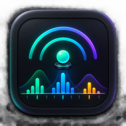

# zigscan

<p align="center">
  
</p>

**A Zigbee site survey tool for AV integrators.** Plug in a CatSniffer, run one
command, and get an answer to the question you actually have on site: *which
Zigbee channel should this system use in this building?*

There is no shortage of 2.4 GHz spectrum analysers. There is a shortage of tools
that speak Zigbee — that count 802.15.4 frames per channel, show you which
channels already have somebody else's mesh on them, and tell you which channel
is clear. That gap is the whole reason this exists.

ZigScan is not simply another Zigbee sniffer. It is an RF diagnostic and site
survey tool for AV integrators: **Field** gives an operational answer, and
**Analysis** lets you inspect frames and PCAPs when that answer needs evidence.


## Two layers, one answer

### Field

Field sweeps Zigbee channels 11-26 and combines the received traffic with the
site's Wi-Fi channel occupancy. It reports detected PANs and networks,
OUI/vendor evidence, RSSI, permit-join state, a channel recommendation, and a
retransmission diagnosis.


### Analysis

Analysis provides targeted capture, raw PCAPs, frame inspection, individual
RSSI, MAC commands, ACKs, source/destination addressing, and a path into
Wireshark for deeper work.


> **The radio never transmits.**
>
> ZigScan does not join, pair, inject or transmit into the Zigbee network. The
> CatSniffer operates as a passive receiver during surveys and captures.

---

## What it tells you

Run a sweep and you get, for each of the 16 Zigbee channels in 2.4 GHz:

- **How many 802.15.4 frames** the radio heard while parked there
- **Whether it overlaps with Wi-Fi**, using the access points, channel widths
  and channels reported by macOS at the site
- **A recommended channel** — the quietest of 15, 20, 25 and 26, the four Zigbee
  channels that fall in the gaps between those Wi-Fi channels

The console shows the same thing as a picture you can turn around and show a
customer, plus a decoded frame view when you want to know *who* is on a channel
rather than just how busy it is.

## What it is not

Being honest about this matters more than the feature list, because the wrong
conclusion here costs a truck roll:

- **It hears Zigbee, not Wi-Fi.** The radio is an 802.15.4 receiver. A channel
  with zero frames means "no Zigbee here" — it does **not** mean "no
  interference here". A microwave, a video sender or a busy access point will
  wreck a channel that this tool reports as empty.
- **The CatSniffer does not measure Wi-Fi or arbitrary RF energy.** The Wi-Fi
  overlay comes from the Mac's Wi-Fi scan, not from the 802.15.4 radio. It cannot
  see non-Wi-Fi interferers such as microwave ovens or video senders; pair it
  with a spectrum survey when the site is dense.
- **Zigbee is quiet when idle.** A short dwell on a real channel can read zero.
  If you need certainty, sweep longer, or have someone toggle a light while you
  scan.
- **It never transmits.** The survey firmware is a passive receiver — it cannot
  join, pair, or disturb the network you are measuring. That is what makes it
  safe to run inside a customer's live system.

## Hardware

| Part | Notes |
|---|---|
| [Electronic Cats CatSniffer](https://github.com/ElectronicCats/CatSniffer) v3.x | RP2040 + CC1352P7. The radio that does the listening. |
| A 2.4 GHz antenna on the SMA port | Easy to forget, and forgetting it looks exactly like a clean site. |

The CC1352P7 must be running **TI sniffer firmware**. `./zigscan identify`
tells you what is on it. See [docs/HARDWARE.md](docs/HARDWARE.md).

Developed and tested on **macOS**. The serial-port detection is macOS-specific
(`/dev/cu.usbmodem*`); Linux support is a small change nobody has needed yet.

## Documentation

| Document | What it is |
|---|---|
| [docs/MANUAL.md](docs/MANUAL.md) | The full manual: firmware, install, reading results, troubleshooting. |
| [docs/FIELD-GUIDE.md](docs/FIELD-GUIDE.md) | One page for the technician on site. |
| [docs/RF-BANDS.md](docs/RF-BANDS.md) | What this tool sees per brand, and its three blind spots. |
| [docs/HARDWARE-OPTIONS.md](docs/HARDWARE-OPTIONS.md) | Which radio to buy, and what other sniffers can feed it. |
| [docs/HARDWARE.md](docs/HARDWARE.md) | Firmware roles, flashing, and the antenna trap. |

## Install

Requirements: **macOS**, Python 3.9+, git, and an Electronic Cats CatSniffer
v3.x. Nothing else — `setup.sh` builds an isolated virtualenv and fetches the
Electronic Cats toolchain at a pinned commit. No system packages are touched.

```bash
git clone https://github.com/SergioMazo/zigscan.git
cd zigscan
./setup.sh
./zigscan identify     # confirm the antenna and its firmware
./zigscan survey       # open the console
```

**A new CatSniffer does not arrive with sniffer firmware.** `setup.sh`
deliberately does not flash anything: writing the sniffer image is a one-way
door over serial, and doing it to an antenna that is somebody's coordinator
costs a callout. `./zigscan identify` tells you what is loaded; [the manual](docs/MANUAL.md) §3 walks the two-stage procedure.

## Use

```bash
./zigscan survey
```

Opens the console at `http://127.0.0.1:8477`. Everything is local; nothing is
uploaded anywhere.

From the terminal, if you prefer:

```bash
./zigscan identify        # what is plugged in, and what firmware it runs
./zigscan scan 6          # sweep 16 channels, 6 s each (~2 min)
./zigscan capture 15 60   # record channel 15 for 60 s to a pcap
./zigscan report file.pcap
```

## Credit where it is due

The hardware and the capture engine are Electronic Cats' work, licensed
GPL-3.0. This is a survey tool built on top of them, not a replacement for them
— see [CREDITS.md](CREDITS.md).

## Licence

GPL-3.0. This builds on Electronic Cats' GPL-3.0 toolchain, so the same terms
carry through, and that is a feature: a tool technicians rely on should be one
they can read and fix. See [LICENSE](LICENSE).
